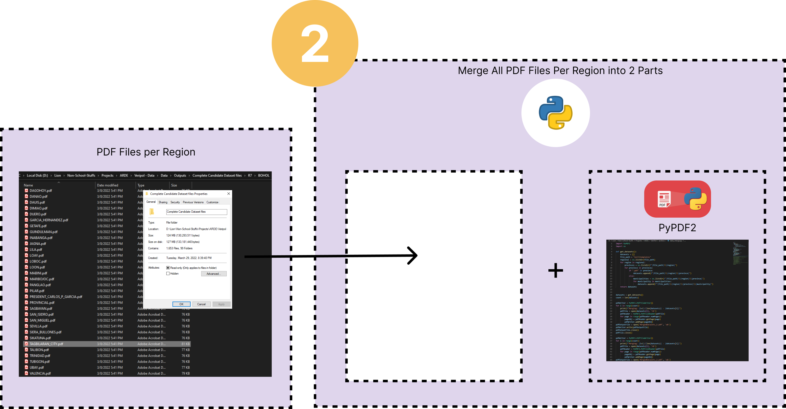
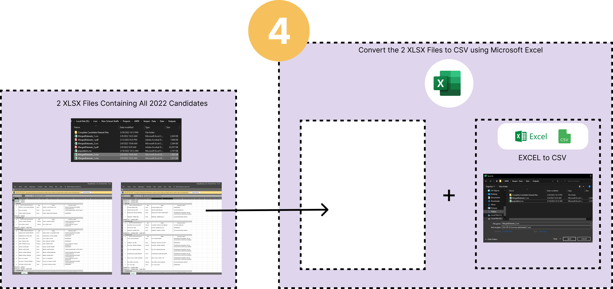
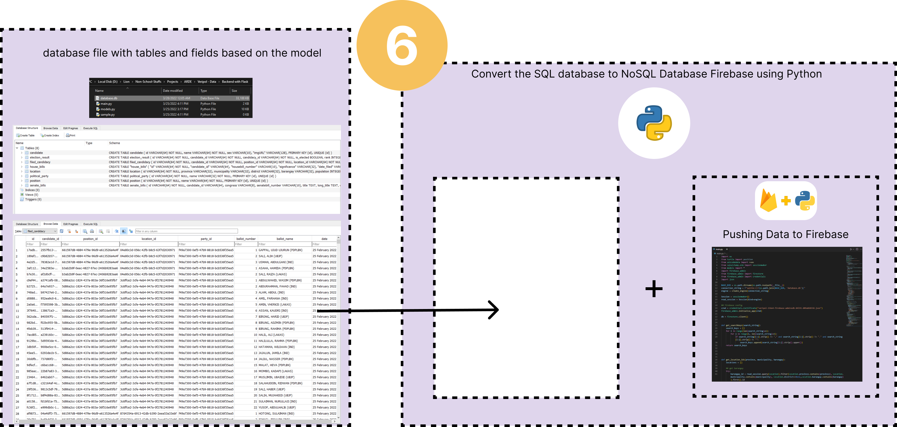

# Overview
Our goal in gathering data was to provide voters with information on the 44,000 candidates running this upcoming elections. We sourced data from previous elections, to get previous candidacy details. We then tried processing election results which became a problem as Comelecs data was hacked and corrupted back in 2016. We also faced the problem of having to mine data with inconsistent formats, which required a different script each time.

## Quick Links
* [VeriPol App Github](https://github.com/Panonce/VeriPol)
* [VeriPol Blog](https://ardetech.notion.site/VeriPol-Blog-03630503e787402a91f6cd59f6d181ab)
* [Subject Matter Experts Interview](https://ardetech.notion.site/Subject-Matter-Experts-4de6ae58fcfd49898fe6245b166ae8ea)
* [Prototype](https://bit.ly/VeriPolPrototype)
* [VeriPol Primer](https://bit.ly/VeriPolPrimer)

## Guide
To reproduce the code, make sure to install all the dependencies and modules with respect to the python script you want to run. The libraries used in each python file are commented right beside the imports

## Data Scraping Journey

### Step 1 (Downloading PDF Files)
It all started with scraping the data from the https://comelec.gov.ph/?r=2022NLE/ListsofCandidates/TentativeListsofCandidates containing PDF files for each local and national candidates

The first step is to use python script that imports beatifulsoup4 to parse the HTML source code from the website and capture the links associated to the anchor tags.
These links are saved to a list in python and after collecting all of the links, it is iterated through a loop and download each file with a user-defined helper function "download(url: str, dest_folder: str, filename: str)"

This process then outputs a set of folders with respect to their location in the format of REGION_NUMBER/PROVINCE/MUNICIPALITY.PNG

### Step 2 (Merging PDF Files)
The PDF Files are then fed to another python script that merges all the PDF files into 2 parts, since this is in preparation for converting the PDF file to and XLSX file.
The limitation occurs in this conversion part where there is a limit of the number of pages that the conversion software can handle.
This merging is just done by PyPDF2 module.

### Step 3 (Converting PDF to XLSX Files)

Since there are already 2 Merged PDF Files, the conversion from PDF to XLSX is also done twice. This is done using Adobe Acrobat by exporting the PDF File as an XLSX File.
This process outputs 2 XLSX Files

### Step 4 (Converting XLSX Files to CSV Files)

The XLSX Files can be coverted to a CSV Files through Microsoft Excel by saving it as a CSV File. Since there are 2 XLSX files, then there will also be 2 CSV Files.
At this point, these 2 CSV files can be merged to one, but following through the experience, they remained to be separated.

### Step 5 (Cleaning the CSV File to a Database File)

The 2 CSV Files are fed to a python script that uses "csv" module to simplify the workload of iterating through each row of the CSV files.
The extraction of data are done based on the Entity Relationship Diagram which are also made as class models in a python file.

At this step, it already requires SQLAlchemy to handle the database. The database contains the following tables
- Location
- Position
- PoliticalParty
- Candidate
- FiledCandidacy
- ElectionResult
- HouseBills
- SenateBills

### Step 6 (Handling the local database to cloud firebase firestore)

The data is first residing on a local database to answer immidiate concerns to create the application. This also saves time and read/write quota incurred from firebase' free tier pack.
Once the data were finalized, the database file is then fed to a python script that imports SQLAlchemy to read the database and pyrebase module to push the data to the firestore.

### Output in the Firebase

After some hours, the data from the local SQLite db are already copied into the NoSQSL firebase firebase.

## Constraints
- Due to limitation of Firebase Firestore Free Tier, pushing previous years of canidadcy (2019, 2016, 2010, etc) is challenging due to time constraints and quota that firebase has allocated for free tier packages. 
- Firebase only allows 50,000 document reads per day
- Firebase only allows 20,000 document writes
The total data for filed candidacy table alone has around 44,000 rows and another 44,000 rows on candidates table just for the 2022 candidates. This huge amount of data takes days or weeks to fully push all of the data. This also implies that including the previous years of candidacies will increase the amount of documment writes needed.
